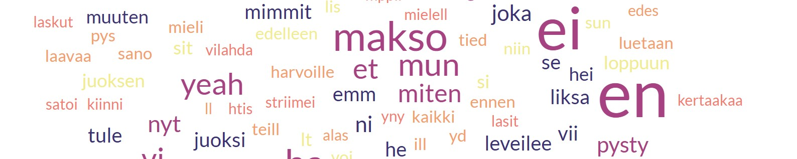

# Trendejä kappaleiden sanoituksissa

Pienimuotoisen projektin tarkoituksena oli harjoitella luonnollisen kielen käsittelyä (NPL) ja tiedonharavointia (web scraping). Tavoitteena oli tutkia millaisia trendejä suomalaisen musiikin sanoituksissa on viimeisen 30 vuoden aikana ollut.

Datasetin luominen aloitettiin hakemalla IFPI:n viikottainen top 50 albumin lista vuodesta 1995 alkaen (https://ifpi.fi/lista/albumit/). Seuraavaksi haettiin kyseisten albumien sisältämät kappaleet Geniusin nettisivuilta (https://genius.com/albums/).
Kappaleiden sanat haettiin LyricsGenius API:lla.

Albumeita aineistossa on 1098 ja kappaleita yhteensä 9034.

Aineisto on kattava, mutta ei täydellinen. Tähän tarkasteluun se tarjoaa kuitenkin riittävän hyvän aineiston suomalaisten musiikkimaun seuraamiseen.

## Tuloksia
Kappaleet ja niiden sanat ryhmiteltiin vuosittain ja laskettiin kunakin vuonna eniten esiintyneet sanat. Nämä jaettiin sanaluokittain.
Tämän jälkeen tarkasteltiin trendejä sanaluokittain viiden vuoden tarkkuudella. Tässä muutama poiminta. 

Mielenkiintoinen havainto on esimerkiksi se, että olla-verbin yleisyys eri taivutusmuotoineen on kasvanut. Voisi pohtia, onko tämä jonkinlaista kielen yksinkertaistumista.

Myös yksittäisten sanojen yleisyyttä tutkittiin. Tietynlaisiin teemoihin liittyvät sanat ovat yleistyneet. Myös englannista lainattujen huudahdusten "yo" ja "yeah" käyttö on kasvanut räjähdysmäisesti.

Ehkä kiinnostavimmat havainnot löytyivät temaattisen analyysin parista. Kappaleet jaettiin kymmeneen teemaan Latent Dirichlet allocation -mallin avulla. 
Haasteeksi muodostui se, että malli ei tahtonut jakaa kappaleita teemoihin tarpeeksi tasaisesti. Joidenkin teemojen data perustuu siis hyvin pieneen otantaan. Alla tulokset.

Lopuksi tarkasteltiin kappaleiden pituuden ja sanastollisen monimuotoisuuden kehitystä.

## Mitä opin?
- Oman aineiston luominen
  - Web scraping (Requests, BeatifulSoup)
  - API:n hyödyntäminen (GeniusAPI)
  - Datalähteiden löytäminen ja päätökset aineiston laajuudesta
- Natural language processing -perusteita
  - NLTK (Natural Language Toolkit)
  - Tokenization
  - Corpus
  - Stopwords
  - Lowercasing
  - Stemming
  - Bag-of-words
  - Kielen tunnistaminen (Langdetect)
  - Lexical diversity
  - Ngramit
- Temaattinen analyysi LDA:n avulla
  - Hyperparametrien säätäminen
